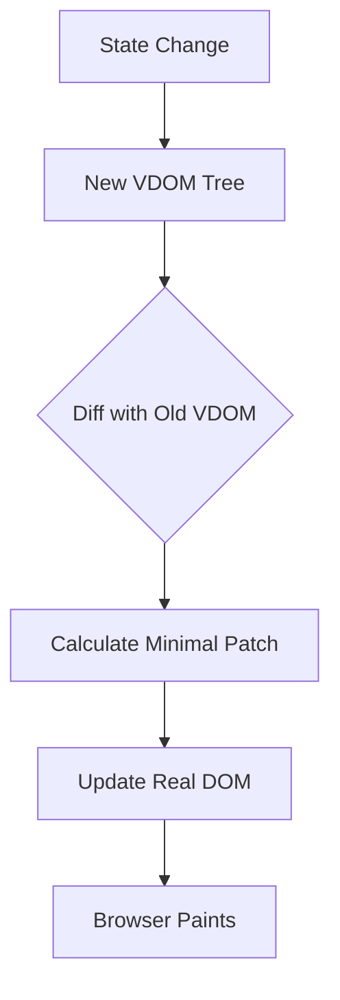

# Visual Asset Registry

> Reference index for all diagrams, flowcharts, and visual learning assets linked throughout this repository.

---

## Asset Index

| ID | Title | Type | Related Questions | Status |
|---|---|---|---|---|
| VIZ-001 | React Component Tree | Diagram | REACT-001, REACT-004 | Planned |
| VIZ-002 | Virtual DOM Diffing Flow | Flowchart | REACT-003, REACT-012 | Planned |
| VIZ-003 | React Reconciliation Algorithm | Diagram | REACT-012, REACT-011 | Planned |
| VIZ-004 | React Fiber Architecture | Diagram | REACT-011, REACT-054 | Planned |
| VIZ-005 | useEffect Timing vs useLayoutEffect | Timeline | REACT-025 | Planned |
| VIZ-006 | React Component Lifecycle (Class) | Diagram | REACT-053 | Planned |
| VIZ-007 | Hook Call Order | Flowchart | REACT-024 | Planned |
| VIZ-008 | Context API Data Flow | Diagram | REACT-033, REACT-043 | Planned |
| VIZ-009 | Flux / Redux Data Flow | Diagram | REACT-044, REACT-048 | Planned |
| VIZ-010 | One-Way Data Flow | Diagram | REACT-045, REACT-015 | Planned |
| VIZ-011 | SSR vs SSG vs CSR Comparison | Diagram | REACT-057, REACT-058 | Planned |
| VIZ-012 | React Hydration Flow | Flowchart | REACT-039, REACT-057 | Planned |
| VIZ-013 | Server Components Architecture | Diagram | REACT-106, REACT-107 | Planned |
| VIZ-014 | Concurrent Rendering Priority Lanes | Diagram | REACT-054, REACT-055 | Planned |
| VIZ-015 | React Router Navigation Flow | Flowchart | REACT-066, REACT-072 | Planned |
| VIZ-016 | useActionState State Machine | Diagram | REACT-103, REACT-102 | Planned |
| VIZ-017 | useOptimistic Flow | Flowchart | REACT-104 | Planned |
| VIZ-018 | Prop Drilling vs Context vs State Manager | Comparison | REACT-050, REACT-048 | Planned |
| VIZ-019 | Testing Pyramid for React | Diagram | REACT-087 | Planned |
| VIZ-020 | Code Splitting Bundle Flow | Diagram | REACT-042, REACT-051 | Planned |

---

## How to Reference a Visual Asset

In canonical knowledge base files, link to visuals using this pattern:

```markdown
> 📊 **Visual:** [VIZ-002 — Virtual DOM Diffing Flow](../../docs/reference/03-visual-assets.md#viz-002)
```

---

## Contributing Visuals

Preferred formats: SVG (vector, scalable), PNG (raster fallback), Mermaid (code-as-diagram for GitHub rendering).

**Mermaid example (renders on GitHub):**



Store asset files in `assets/diagrams/` when created.

---

*← [Source Library](./02-source-library.md) | [Master Index](./00-master-index.md)*
